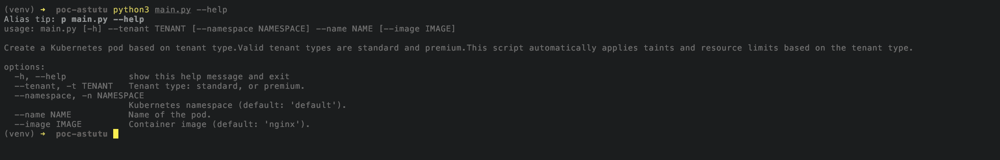
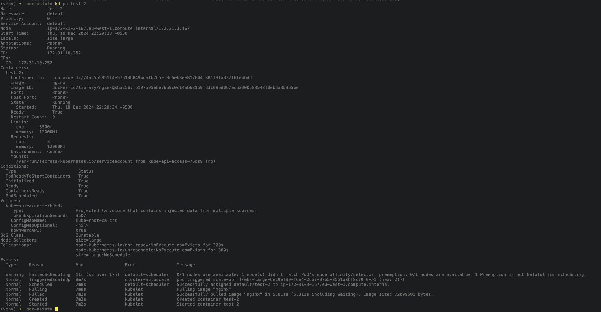
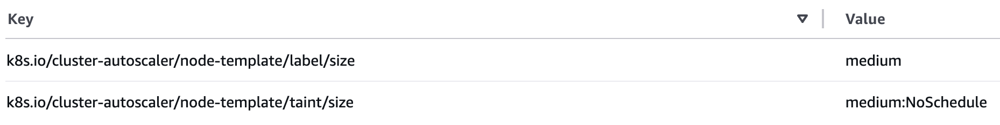

# Dynamic Pod Scheduling 

## Objective  

We want to ensure that pods are scheduled on nodes that match the tenant type. Each tenant type (standard or premium) is linked to a specific node group with different instance types and resources. The Cluster Autoscaler will automatically add nodes when needed to meet these requirements.

### Key Implementation Details:  
- **One-to-one mapping**: Each pod corresponds to a node.  
- **Scalable node creation**: If two tenants of the same type are created simultaneously, two new nodes of the respective type will be spun off.

## What Are We Achieving?  

This setup tests Kubernetes and Cluster Autoscaler’s ability to schedule pods on the right nodes based on taints and tolerations. Some key benefits include:  
- **Cost Optimization**: Scales nodes only when necessary, saving resources.  
- **Efficient Scheduling**: Matches tenant needs with the right instance types.

## Prerequisites  

### Tools Needed:  

1. **AWS CLI**: Installed and configured with access keys.  
2. **Terraform**: Installed for infrastructure setup.  
3. **kubectl**: Installed for interacting with Kubernetes clusters.  
4. **Python & Pip**: Installed to run automation scripts.  

### Cluster Setup  

Ensure that you have an EKS cluster deployed with the **Cluster Autoscaler** configured.  
If not, follow the setup instructions in the [infra/README.md](./infra/README.md).

## Node Group Configuration  

Set up two node groups with the following configurations:  

> If you have followed above guide to create infrastructure, you could skip this step.

| **Node Group** | **Instance Types** | **Taints**                                 | **Labels**      | **Scaling Config**                  | **Tenant Type**  |  
|----------------|--------------------|--------------------------------------------|-----------------|-------------------------------------|------------------|  
| **large**      | `t3a.xlarge`       | `key: size`, `value: large`, `effect: NO_SCHEDULE` | `size=large`    | desired: 1, max: 3, min: 1         | **premium**      |  
| **medium**     | `t3a.medium`       | `key: size`, `value: medium`, `effect: NO_SCHEDULE` | `size=medium`   | desired: 1, max: 5, min: 1         | **standard**     |

> **Note**: Ensure taints and labels match the pod scheduling requirements.

## Steps  

### 1. Install Python Packages  

First, install the required Python packages:  
```bash  
pip3 install -r requirements.txt  
```  

### 2. View Available Script Options  

You can list all available script options with:  
```bash  
python3 main.py --help  
```  


### 3. Create Tenants  

Create tenants corresponding to specific pod scheduling requirements. For example:

- **Create a Standard Tenant**:  
  ```bash  
  python3 main.py -t standard --name standard-1  
  python3 main.py -t standard --name standard-2  
  ```  

- **Create a Premium Tenant**:  
  ```bash  
  python3 main.py -t premium --name premium-1     
  python3 main.py -t premium --name premium-2     
  ```  

---

## Expected Behavior  

1. **Pod Scheduling**:  
   - Initially, the pod will be in the pending state if no suitable nodes are available.  
   - The Cluster Autoscaler will scale up nodes in the appropriate node group to meet the scheduling requirements.  

2. **Node Taint Matching**:  
   - Pods will only be scheduled on nodes with matching taints for their tenant type.  

3. **Dynamic Scaling**:  
   - Nodes will automatically scale down when no longer needed. 



## Future Improvements  

We can enhance the current solution by introducing a **custom Helm chart**. This would allow us to manage the deployment of resources (e.g., Deployment, Service) for each tenant, ensuring that the pods and services are consistently deployed according to each tenant's needs. Here are a few ideas:

- **Multi-resource Management**: Add resources such as services, configmaps, secrets, and deployments to the chart for better tenant management.  
- **Tenant-specific Configuration**: Allow dynamic generation of resource configurations based on tenant parameters.  
- **Resource Dependencies**: Ensure that resources are created in a specific order based on interdependencies.

## ⚠️ Current Limitation/Bug

As of this implementation, we cannot scale the desired node to 0 on startup.

> Currently, items in the node info cache are updated only if there are any nodes in the node group. If the node group is scaled down to 0, the node info cache will store the last node and use it in the scale-up algorithm. Thus, if the last node is not representative of the node group (for example, it has custom taints), the Cluster Autoscaler may struggle to scale up this node group.

[Source](https://github.com/kubernetes/autoscaler/pull/4669)

Since we don't have any nodes to begin with, the Cluster Autoscaler fails to bring the node up despite having the correct configuration in place, and will give the following error:

```sh
I1219 17:02:40.780094       1 orchestrator.go:594] Pod default/test-1 can't be scheduled on eks-large-56c9efb8-09b4-a2a8-50c7-7a370d197f3a, predicate checking error: node(s) didn't match Pod's node affinity/selector; predicateName=NodeAffinity; reasons: node(s) didn't match Pod's node affinity/selector; debugInfo=
```

Notice that the `debugInfo` field is empty as autoslacer could not fetch data about the taints set on the ASG.

This [documentation](https://github.com/kubernetes/autoscaler/blob/master/cluster-autoscaler/cloudprovider/aws/README.md#auto-discovery-setup) provides a workaround by setting tags on the ASG.



I have attempted to use this option, but it still doesn't work as expected. 

I have implemented a similar setup in GCP for a slightly different project, and it worked seamlessly there. Although GCP uses its build-in autoscaler but the core engine under the hood is same.

To resolve this bug, more research is required, and I will likely need to explore the following [comment](https://github.com/kubernetes/autoscaler/issues/5718#issuecomment-1529956530) for more insight.