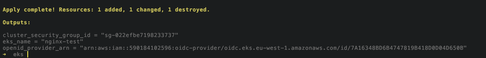

# Deploying EKS and Cluster-Autoscaler

This document outlines the steps to deploy an EKS cluster and set up the Cluster-Autoscaler using Terraform.

## Step 1: Deploy EKS Cluster

1. **Navigate to the `infra/eks` directory:**

   ```bash
   cd infra/eks
   ```

2. **Initialize Terraform:**

   Run the following command to initialize the Terraform configuration:

   ```bash
   terraform init
   ```

   Make sure your AWS credentials are configured for the account where the infrastructure will be deployed.

3. **Configure Variables:**

   Update the `subnet_ids` variable in the `deploy/deploy.tfvars` file to include the subnet IDs of your VPC.

4. **Apply Terraform Configuration:**

   Run the following command to deploy the EKS cluster:

   ```bash
   terraform apply -var-file=deploy/deploy.tfvars
   ```

   After a successful deployment, the output will include details that are required for the next step. For example:
   
   

## Step 2: Set Up Cluster-Autoscaler

1. **Configure Kubeconfig:**

   Once the EKS cluster is up, set the kubeconfig context to the newly created cluster:

   ```bash
   aws eks update-kubeconfig --region eu-west-1 --name nginx-test
   ```

2. **Set the KUBE_CONFIG_PATH:**

   Run the following command to set the KUBE_CONFIG_PATH environment variable:

   ```bash
   export KUBE_CONFIG_PATH=~/.kube/config
   ```

3. **Navigate to the Cluster-Autoscaler Directory:**

   Change directory to `infra/cluster-autoscaler`:

   ```bash
   cd infra/cluster-autoscaler
   ```

4. **Initialize Terraform:**

   Run the following command to initialize the Cluster-Autoscaler configuration:

   ```bash
   terraform init
   ```

   Ensure that your AWS credentials are configured for the correct account.

5. **Configure Variables:**

   Update the `deploy/deploy.tfvars` file with appropriate values from the above generated output.

6. **Apply Terraform Configuration:**

   Run the following command to deploy the Cluster-Autoscaler:

   ```bash
   terraform apply -var-file=deploy/deploy.tfvars
   ```

7. **Verify the Cluster-Autoscaler Pod:**

   Use `kubectl` to check if the Cluster-Autoscaler pod is running:

   ```bash
   kubectl -n kube-system get pods
   ```

   Ensure that the `cluster-autoscaler` pod is running.